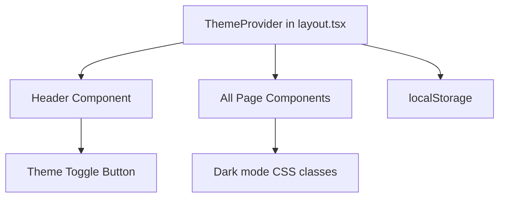

# Dark Mode Design

## Technical Solution

### 1. Theme Provider: next-themes
Use `next-themes` package which handles:
- Theme state management
- localStorage persistence
- SSR/hydration without flash
- System preference detection

### 2. Implementation Architecture



### 3. Component Changes

#### layout.tsx
- Wrap the app with `ThemeProvider` from next-themes
- Set attribute="class" for Tailwind CSS compatibility

#### Header.tsx  
- Add theme toggle button (sun/moon icon)
- Position at right side of header

### 4. Visual Design

#### CSS Variables Approach
Define color variables in globals.css that change based on theme:

```css
:root {
  --color-background: #ffffff;
  --color-text: #111827;
  --color-border: #d1d5db;
  --color-link: #2563eb;
  --color-code-bg: #f3f4f6;
}

.dark {
  --color-background: #111827;
  --color-text: #f3f4f6;
  --color-border: #374151;
  --color-link: #60a5fa;
  --color-code-bg: #1f2937;
}
```

#### Tailwind Configuration
- Extend theme to use CSS variables:
```js
colors: {
  background: 'var(--color-background)',
  text: 'var(--color-text)',
  border: 'var(--color-border)',
  link: 'var(--color-link)',
  'code-bg': 'var(--color-code-bg)',
}
```

#### Toggle Button
- Icon-based (sun for light, moon for dark)
- Smooth transition on hover
- Clear active state

### 5. Implementation Pattern
```css
/* Use semantic color names instead of hardcoded colors */
<div className="bg-background text-text border-border">
```